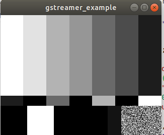

# Gstreamer Rust code samples

1. Playback Audio pipeline 

2. Playback Audio Video pipeline 

3. Visualize audio

Gewnerate Audio , convert it , use analyze audio spectrum

4. Video Processing Pipeline

Use test video to convert its format and add a grayscale filter with 

    filter.set_property("saturation", 0.0); // Grayscale effect

